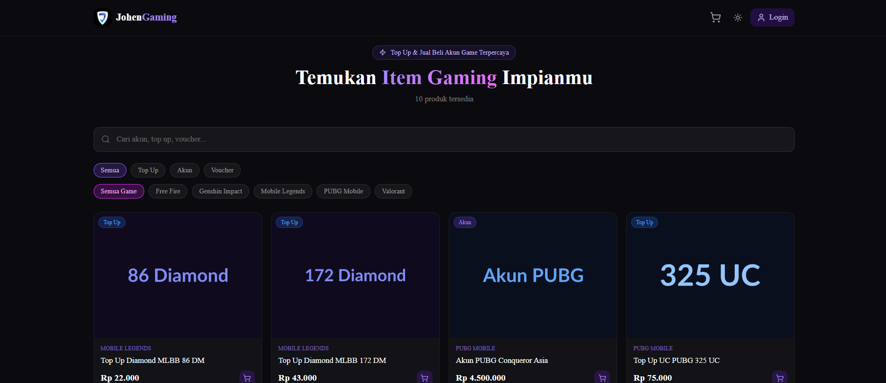
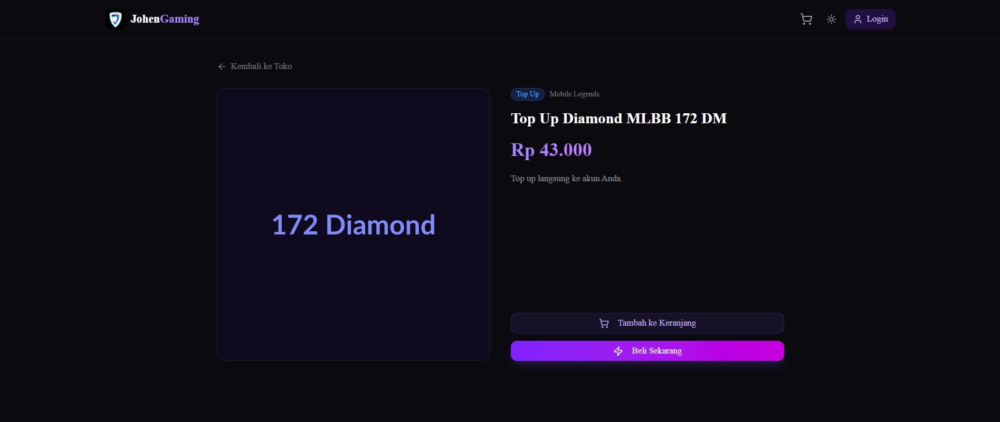
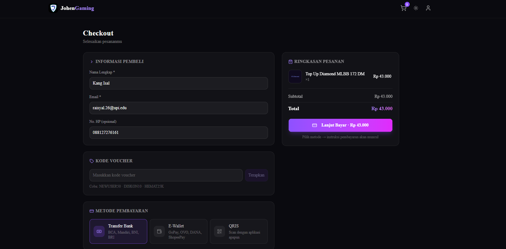
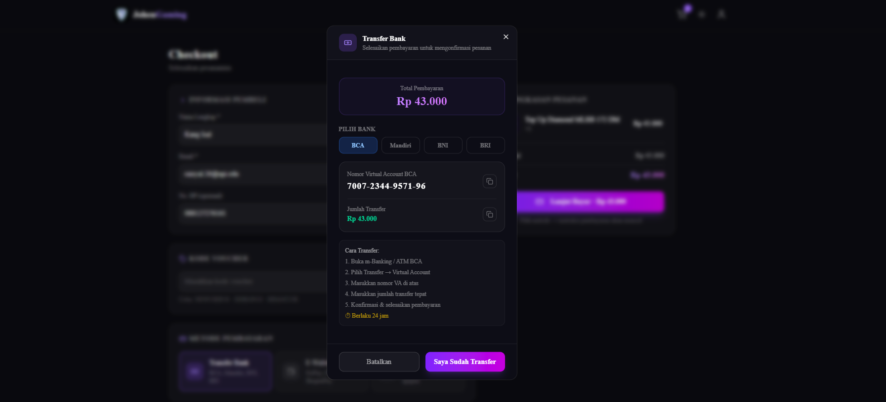
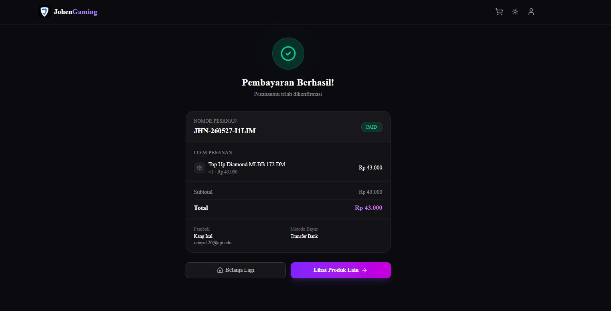
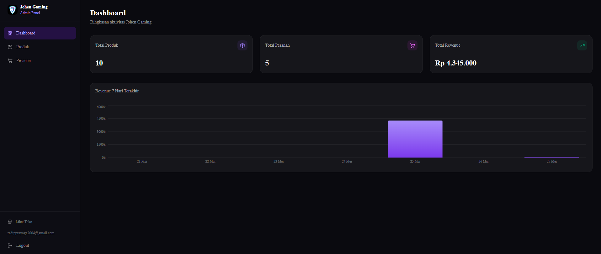
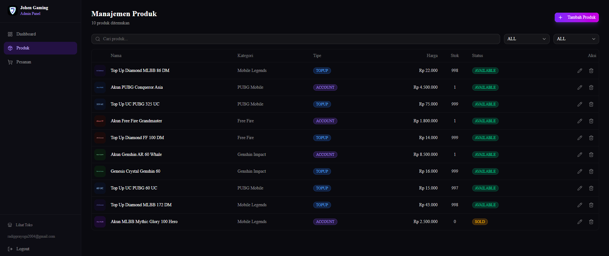
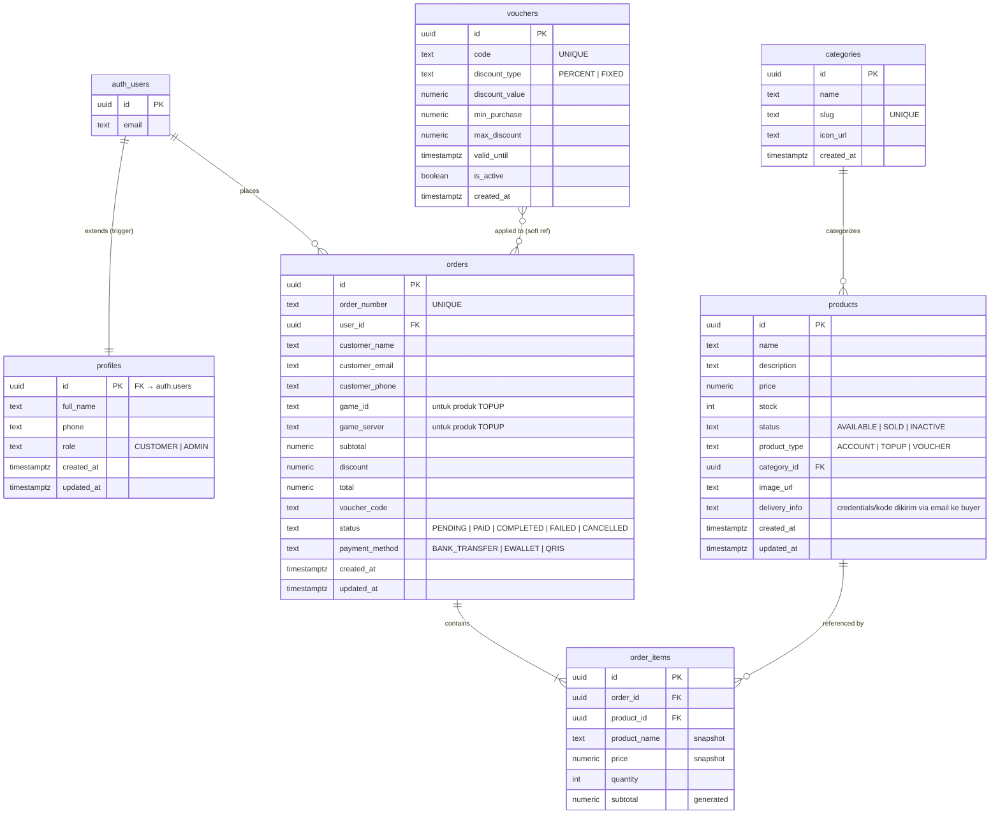

# Johen Gaming — Gaming Marketplace

Prototype marketplace untuk jual-beli akun & top-up game. Dibuat sebagai penilaian Fullstack Developer di PT Johen Gaming.

---

## Tech Stack & Alasan Pemilihan

| Layer | Teknologi | Alasan |
|-------|-----------|--------|
| Framework | **Next.js 16.2 (App Router)** | SSR + RSC memungkinkan data fetching di server — produk & kategori langsung tersedia saat HTML dikirim, lebih cepat dari SPA murni. File-based routing mempercepat scaffold. |
| Database & Auth | **Supabase (PostgreSQL)** | BaaS managed = tidak perlu setup server auth sendiri. RLS di level database menjamin data isolation per user. Supabase Storage menangani upload gambar produk secara konsisten. |
| State Management | **Zustand v5 + `persist`** | Ringan, tidak ada boilerplate reducer. Cart di-persist ke `localStorage` agar tidak hilang saat refresh — sesuai ekspektasi pengguna e-commerce. |
| Styling | **Tailwind CSS v4** | Utility-first mempercepat iterasi desain tanpa context switching ke file CSS terpisah. v4 menghapus `purge` config — build lebih cepat dengan Turbopack. |
| UI Components | **shadcn/ui** | Komponen headless yang fully owned (bukan dependency) — bisa dimodifikasi bebas untuk theming dark marketplace. |
| Validasi | **Zod v4 + React Hook Form** | Schema tunggal dipakai di client (real-time feedback) dan server (route handler) — tidak ada duplikasi validasi logic. |
| Notifikasi | **Sonner** | Toast ringan, animasinya tidak mengganggu dark theme, zero config. |
| QR Code | **qrcode.react** | Kebutuhan spesifik payment modal (QRIS/E-Wallet). Library kecil, SVG output skalabel. |
| Email | **EmailJS** | Pengiriman email konfirmasi order langsung dari client-side tanpa server SMTP. Template fleksibel, free tier 200 email/bulan, tidak membutuhkan domain sendiri. |
| Theming | **next-themes** | Toggle light/dark mode dengan persistensi ke `localStorage`, zero-flash pada reload berkat `suppressHydrationWarning`. |

---

## Arsitektur

```
┌─────────────────────────────────────────────────────────┐
│                    Browser (React 19)                   │
│  Client Components ─── Zustand Store (cart persist)    │
│  EmailJS ──────────── kirim email konfirmasi ke buyer  │
└────────────────────────┬────────────────────────────────┘
                         │ fetch('/api/...')
┌────────────────────────▼────────────────────────────────┐
│              Next.js 16 App Router (Node.js)            │
│                                                         │
│  proxy.ts ──── auth guard (/admin/*, /checkout,        │
│                /order-success, redirect auth pages)     │
│                                                         │
│  Route Handlers (/api/*)                                │
│  ├── auth/login  register  logout                       │
│  ├── products  products/:id                             │
│  ├── categories                                         │
│  ├── orders  orders/:orderNumber                        │
│  ├── vouchers/validate                                  │
│  └── admin/stats                                        │
│                                                         │
│  Service Layer                                          │
│  ├── auth.service.ts  (signIn, signUp)                  │
│  ├── product.service.ts  (list, getById, CRUD)          │
│  ├── category.service.ts  (list, CRUD)                  │
│  ├── order.service.ts  (create via RPC, list, get)      │
│  └── voucher.service.ts  (validate)                     │
└────────────────────────┬────────────────────────────────┘
                         │ @supabase/ssr
┌────────────────────────▼────────────────────────────────┐
│                      Supabase                           │
│  PostgreSQL ── RLS policies ── Storage (images)         │
│  Auth (JWT, sessions via cookies)                       │
│  RPC: create_order_atomic (transactional order insert)  │
└─────────────────────────────────────────────────────────┘
```

### Alur Request (Checkout)

```
User isi form → validate (Zod + RHF)
  → Jika TOPUP: wajib isi Game ID & Server
  → PaymentModal terbuka (Bank Transfer / E-Wallet / QRIS)
  → User konfirmasi → POST /api/orders
      → order.service → supabase.rpc('create_order_atomic')
          → insert orders + order_items (atomic, 1 transaksi)
          → UPDATE orders SET game_id, game_server (jika TOPUP)
  → cart.clearCart() → redirect /order-success/:orderNumber
      → EmailJS kirim email konfirmasi ke customer_email
          → ACCOUNT: sertakan credentials akun (dari delivery_info)
          → TOPUP: sertakan Game ID + estimasi proses
          → VOUCHER: sertakan kode voucher (dari delivery_info)
```

---

## Fitur

**Shop (Customer)**
- Browse produk dengan filter kategori & pencarian real-time
- Halaman detail produk
- Cart persisten (localStorage via Zustand) — terisolasi per user session
- Checkout dengan validasi form lengkap
- Input **Game ID & Server** otomatis muncul di checkout untuk produk TOPUP
- Payment modal: Bank Transfer (Virtual Account), E-Wallet (QR), QRIS
- Voucher diskon (PERCENT & FIXED)
- Halaman konfirmasi pesanan dengan ringkasan order
- **Email konfirmasi otomatis** terkirim ke buyer setelah checkout berhasil — berisi detail order, credentials akun (ACCOUNT), kode voucher (VOUCHER), atau status proses top-up (TOPUP)
- Light / Dark mode toggle (persisten)
- Redirect ke login jika belum login saat akses checkout

**Admin Panel**
- Dashboard statistik (revenue, order, produk, user)
- Manajemen produk: tambah, edit, hapus, upload gambar
- Field **"Info Pengiriman ke Pembeli"** (`delivery_info`) — admin isi dengan credentials akun / kode voucher yang akan otomatis dikirim via email ke buyer
- Manajemen pesanan: filter status, lihat detail
- Route guard di `proxy.ts` (ADMIN role only)
- Mode preview untuk admin yang browsing shop (tidak bisa checkout)

**Auth**
- Register & Login dengan Supabase Auth
- Session via HTTP-only cookies (`@supabase/ssr`)
- Role-based redirect: ADMIN → `/admin`, CUSTOMER → `/shop`
- Cart di-reset saat login/logout untuk mencegah kebocoran data antar user

---

## Screenshots

### Shop
| Homepage | Detail Produk |
|----------|---------------|
|  |  |

### Checkout & Order
| Checkout — Isi Form | Checkout — Pilih Pembayaran |
|---------------------|----------------------------|
|  |  |

| Order Success |
|---------------|
|  |

### Admin Panel
| Dashboard | Manajemen Produk |
|-----------|-----------------|
|  |  |

---

## Entity Relationship Diagram



> Semua tabel menggunakan **Row Level Security (RLS)**. `create_order_atomic` RPC mengeksekusi insert `orders` + `order_items` + decrement stock dalam satu transaksi atomik.

---

## Setup Lokal

### Prerequisites

- Node.js 20+
- pnpm (`npm i -g pnpm`)
- Akun [Supabase](https://supabase.com)
- Akun [EmailJS](https://emailjs.com) (untuk email konfirmasi)

### Langkah

```bash
# 1. Clone & install
git clone <repo-url>
cd johen-marketplace
pnpm install

# 2. Environment variables
cp .env.local.example .env.local
# Isi nilai dari: Supabase Dashboard → Project Settings → API
# dan EmailJS Dashboard → Account
```

**.env.local**

```env
NEXT_PUBLIC_SUPABASE_URL=https://<project-ref>.supabase.co
NEXT_PUBLIC_SUPABASE_ANON_KEY=<anon-key>
SUPABASE_SERVICE_ROLE_KEY=<service-role-key>
NEXT_PUBLIC_APP_URL=http://localhost:3000

NEXT_PUBLIC_EMAILJS_SERVICE_ID=service_xxxxxxx
NEXT_PUBLIC_EMAILJS_TEMPLATE_ID=template_xxxxxxx
NEXT_PUBLIC_EMAILJS_PUBLIC_KEY=xxxxxxxxxxxxxxxxxxxx
```

```bash
# 3. Jalankan migrasi di Supabase SQL Editor (urutan penting):
#    supabase/migrations/20260523000001_init_schema.sql
#    supabase/migrations/20260523000002_rls_policies.sql
#    supabase/migrations/20260523000003_seed_data.sql
#    supabase/migrations/20260525000004_seed_images.sql
#    supabase/migrations/20260525000005_fix_image_urls.sql
#    supabase/migrations/20260525000006_restore_image_text.sql
#    supabase/migrations/20260526000007_enable_realtime_orders.sql
#    supabase/migrations/20260608000008_add_delivery_info.sql
#    supabase/migrations/20260608000009_add_game_fields_to_orders.sql

# 4. Jalankan dev server
pnpm dev
# Buka http://localhost:3000
```

---

## Demo Credentials

**URL**: https://johen-marketplace.vercel.app

| Role | Email | Password |
|------|-------|----------|
| Admin | admin@johengaming.com | admin123 |
| Customer | user@johengaming.com | user1234 |

> Buat akun customer baru via `/register`. Untuk akun admin baru: buat user di Supabase Dashboard → Authentication → Users, lalu set `role = 'ADMIN'` di tabel `profiles`.

### Demo Voucher Codes

| Kode | Tipe | Nilai | Min. Belanja | Max Diskon | Keterangan |
|------|------|-------|--------------|------------|------------|
| `NEWUSER50` | PERCENT | 50% | Rp 50.000 | Rp 25.000 | Diskon 50% untuk pembelian pertama |
| `DISKON10` | PERCENT | 10% | Rp 100.000 | — | Diskon 10% tanpa batas maksimum |
| `HEMAT25K` | FIXED | Rp 25.000 | Rp 200.000 | — | Potongan langsung Rp 25.000 |

> Masukkan kode voucher di halaman checkout sebelum konfirmasi pembayaran.

---

## API Endpoints

### Auth

| Method | Path | Body | Keterangan |
|--------|------|------|------------|
| POST | `/api/auth/login` | `{ email, password }` | Login, set session cookie |
| POST | `/api/auth/register` | `{ email, password, full_name }` | Daftar akun baru |
| POST | `/api/auth/logout` | — | Hapus session |

### Produk & Kategori

| Method | Path | Query / Body | Keterangan |
|--------|------|--------------|------------|
| GET | `/api/products` | `page, limit, search, type, status, sort, category` | List produk (publik) |
| GET | `/api/products/:id` | — | Detail produk |
| POST | `/api/products` | JSON (fields + image_url) | Tambah produk (admin) |
| PUT | `/api/products/:id` | JSON | Update produk (admin) |
| DELETE | `/api/products/:id` | — | Hapus produk (admin) |
| GET | `/api/categories` | — | List kategori |

### Pesanan

| Method | Path | Body / Query | Keterangan |
|--------|------|--------------|------------|
| POST | `/api/orders` | `{ customer_name, customer_email, customer_phone?, payment_method, items[], voucher_code?, game_id?, game_server? }` | Buat pesanan (auth required) |
| GET | `/api/orders` | `page, limit, status` | List pesanan (admin) |
| GET | `/api/orders/:orderNumber` | — | Detail pesanan + delivery_info produk |

### Voucher

| Method | Path | Body | Keterangan |
|--------|------|------|------------|
| POST | `/api/vouchers/validate` | `{ code, subtotal }` | Validasi & hitung diskon |

### Admin

| Method | Path | Keterangan |
|--------|------|------------|
| GET | `/api/admin/stats` | Statistik dashboard (admin only) |

**Format response:**

```json
{ "success": true, "data": { ... } }
{ "success": false, "error": "Pesan error" }
```

---

## SDLC Notes

- **Email konfirmasi**: Dikirim via EmailJS dari client-side saat customer landing di halaman order-success. Template di EmailJS harus memiliki variabel: `to_email`, `customer_name`, `order_number`, `items_list`, `total`, `payment_method`, `delivery_info`.
- **delivery_info**: Diisi admin di form produk. Untuk ACCOUNT: credentials akun. Untuk VOUCHER: kode voucher. Untuk TOPUP: bisa kosong, email otomatis menyertakan instruksi cek game + Game ID customer.
- **Game ID/Server**: Disimpan di kolom `game_id` dan `game_server` di tabel `orders`. Field ini hanya muncul di checkout ketika cart mengandung produk bertipe TOPUP.
- **Auth guard**: Diimplementasikan di `proxy.ts` (bukan `middleware.ts`) — sesuai konvensi Next.js custom di project ini. Melindungi `/checkout`, `/order-success`, dan `/admin`.
- **Payment flow**: Simulasi — VA number, QR code, dan QRIS bersifat demo. Production membutuhkan integrasi payment gateway (Midtrans/Xendit webhook) yang akan mengupdate status order ke `PAID`/`FAILED`.
- **Order status**: Tetap `PENDING` setelah checkout simulasi. Webhook payment gateway akan mengupdate status ke `PAID`/`FAILED`.
- **Gambar produk**: Untuk production, upload gambar asli via Admin Panel → form produk → Supabase Storage.

---

## Kendala saat Development

### 1. React Compiler ESLint False Positives
Next.js 16 mengaktifkan React Compiler secara default, yang membawa rule ESLint baru seperti `react-hooks/set-state-in-effect`. Pattern standar React yang sudah sangat umum — seperti `useEffect(() => { setMounted(true) }, [])` untuk hydration-safe rendering — justru di-flag sebagai violation. Ini bukan bug pada kode, melainkan ketidaksesuaian antara rule yang terlalu agresif dengan pola yang sudah established. Solusi: menambahkan override `"react-hooks/set-state-in-effect": "off"` di `eslint.config.mjs`.

### 2. Tailwind CSS v4 Breaking Changes pada Nama Class
Tailwind v4 memperkenalkan "canonical class" yang menggantikan beberapa nama lama: `bg-gradient-to-r` → `bg-linear-to-r`, `aspect-[4/3]` → `aspect-4/3`, `bg-white/[0.03]` → `bg-white/3`. Build tetap berhasil karena Tailwind masih menerima keduanya, namun ESLint mengeluarkan warning untuk semua class non-canonical. Setiap komponen yang menggunakan class tersebut harus ditelusuri dan diganti manual satu per satu.

### 3. Cart Persisten Bocor Antar User
Zustand dengan middleware `persist` menyimpan cart di `localStorage` menggunakan key yang sama untuk semua user (`cart-storage`). Ketika user A logout lalu user B login, cart user A masih terbaca oleh user B karena `localStorage` tidak otomatis dibersihkan saat sesi berganti. Bug ini baru terdeteksi saat simulasi registrasi user baru. Solusi: memanggil `clearCart()` secara eksplisit di tiga titik — saat login berhasil, saat logout di shop header, dan saat logout di admin sidebar.

### 4. Payment Modal Terpotong di Viewport 100% Zoom
`DialogContent` dari Radix UI tidak membatasi tinggi secara otomatis. Pada resolusi desktop standar (1920×1080, 100% zoom) dengan konten modal yang panjang (form + opsi pembayaran + QR code), bagian bawah modal terpotong dan tombol konfirmasi tidak terlihat. Pengguna harus memperkecil zoom ke 80% untuk melihat keseluruhan modal. Solusi: menambahkan `flex flex-col max-h-[90vh]` pada `DialogContent` dan `flex-1 overflow-y-auto` pada body konten agar modal dapat di-scroll di dalam viewport.

### 5. `Date.now()` dalam Render Menyebabkan React Compiler Error
String referensi QR (`JHN-${Date.now()}`) awalnya digenerate langsung di JSX, yaitu di dalam render function. React Compiler mendeteksi ini sebagai fungsi impure karena menghasilkan nilai berbeda setiap render. Error: `react-hooks/purity`. Solusi: memindahkan inisialisasi ke `useState(() => \`JHN-${Date.now()}\`)` agar hanya dieksekusi sekali saat komponen pertama kali mount.

### 6. Hydration Mismatch dengan `next-themes`
`ThemeProvider` dari `next-themes` membaca preferensi tema dari `localStorage` di sisi client, sementara server selalu me-render HTML tanpa class `dark`. Ini menyebabkan React mendeteksi perbedaan antara HTML server dan client (hydration mismatch) dan memunculkan warning. Solusi: menambahkan `suppressHydrationWarning` pada tag `<html>` di root layout, yang memberitahu React bahwa perbedaan atribut di elemen ini memang disengaja.

### 7. Tampilan Light Mode Tidak Terlihat (Invisible UI)
Seluruh desain awal dibuat untuk dark mode menggunakan class seperti `text-white/50`, `bg-white/5`, `border-white/10`. Ketika light mode diaktifkan, elemen-elemen ini hampir tidak terlihat di atas background terang — teks menjadi putih transparan di atas putih, border tidak ada, tombol menghilang. Diperlukan audit menyeluruh pada semua komponen publik (shop header, cart drawer, product card, category filter, checkout, order-success, payment modal, halaman auth) untuk menambahkan counterpart light mode dengan `dark:` prefix, misalnya `text-black/50 dark:text-white/50`.

### 8. PowerShell Tidak Kompatibel dengan Path Berparenthesis
Direktori Next.js App Router menggunakan konvensi route group dengan nama folder berparenthesis seperti `(auth)` dan `(shop)`. Di PowerShell, karakter `(` dan `)` diinterpretasikan sebagai subexpression — sehingga perintah `git add src/app/(auth)/layout.tsx` mengakibatkan error `The term 'auth' is not recognized`. Solusi: selalu membungkus path yang mengandung parenthesis dengan tanda kutip ganda: `git add "src/app/(auth)/layout.tsx"`.

### 9. GitHub Contributor Cache Tidak Langsung Update Setelah History Rewrite
Setelah seluruh git history ditulis ulang menggunakan `git filter-branch` dan kemudian diganti total dengan orphan branch (satu commit bersih tanpa Co-Authored-By), GitHub tetap menampilkan contributor lama di sidebar repository. Ini adalah cache server-side GitHub yang dibangun secara asynchronous dan tidak bisa di-trigger ulang secara manual. Satu-satunya cara yang menjamin pembersihan segera adalah menghapus repository dan membuatnya ulang dengan nama yang sama, lalu push ulang branch yang sudah bersih.

### 10. Konflik `middleware.ts` vs `proxy.ts` di Vercel
Next.js secara konvensi menggunakan `middleware.ts` di root `src/` untuk request interception. Namun project ini sudah menggunakan `proxy.ts` sebagai custom middleware file. Ketika `middleware.ts` dibuat untuk menambah auth guard, Vercel build gagal dengan error "Both middleware file and proxy file detected". Solusi: hapus `middleware.ts`, pindahkan semua auth guard logic ke `proxy.ts` yang sudah ada.

### 11. Resend Free Tier — Batasan Domain Pengirim
Resend (layanan email transaksional) pada free tier hanya mengizinkan pengiriman email ke alamat email pemilik akun Resend jika menggunakan sender `onboarding@resend.dev`. Untuk mengirim ke email customer manapun, diperlukan domain sendiri yang diverifikasi di Resend. Solusi untuk prototype: beralih ke **EmailJS** yang tidak memiliki batasan penerima, menggunakan Gmail sebagai transport, dan beroperasi sepenuhnya dari client-side tanpa konfigurasi domain.

---

## Scalability Improvements

Berikut peningkatan yang perlu dilakukan jika aplikasi ini dikembangkan lebih lanjut ke skala production:

### Infrastruktur & Backend
- **Payment Gateway Integration** — Integrasi Midtrans atau Xendit dengan webhook untuk auto-update status order (`PENDING` → `PAID`/`FAILED`) secara realtime, menggantikan simulasi saat ini.
- **Queue System** — Gunakan Upstash QStash atau BullMQ untuk memproses task async seperti pengiriman email notifikasi, generate invoice PDF, dan update stok setelah pembayaran dikonfirmasi.
- **Rate Limiting** — Tambahkan rate limiting di API route kritis (`/api/auth/login`, `/api/orders`) menggunakan Upstash Redis untuk mencegah brute force dan abuse.
- **Supabase Edge Functions** — Pindahkan logika `create_order_atomic` dan validasi voucher ke Edge Functions agar eksekusi lebih dekat ke database dan mengurangi latency round-trip.

### Performa & Skalabilitas
- **Cursor-Based Pagination** — Ganti offset pagination saat ini (`page * limit`) dengan cursor-based untuk performa konsisten di dataset besar (jutaan produk/order).
- **Query Caching** — Cache hasil query produk populer dan statistik dashboard di Redis/Upstash dengan TTL pendek (1–5 menit) untuk mengurangi beban database.
- **Image CDN** — Migrasikan storage gambar dari Supabase Storage ke Cloudflare R2 + CDN global untuk delivery gambar yang lebih cepat dan lebih murah di trafik tinggi.
- **Supabase Realtime untuk Stok** — Gunakan Supabase Realtime subscription di halaman produk untuk live-update stok, mencegah dua user checkout produk yang sama secara bersamaan (race condition).

### Fitur Bisnis
- **Multi-Seller Support** — Tambahkan tabel `sellers`/`stores` agar marketplace dapat menampung banyak merchant dengan dashboard masing-masing dan revenue sharing.
- **Full-Text Search** — Integrasikan Algolia atau gunakan `pgvector` di Supabase untuk pencarian produk yang lebih relevan (fuzzy matching, typo tolerance, ranking by popularity).
- **Sistem Review & Rating** — Tabel `reviews` terhubung ke `order_items` agar buyer hanya bisa review produk yang sudah dibeli, menjaga kredibilitas rating.
- **Top-Up API Integration** — Integrasi langsung dengan API publisher game (Garena, Moonton, Riot) atau aggregator top-up (Digiflazz, VIPayment) untuk proses top-up otomatis tanpa intervensi admin.
- **Email Transaksional Skala Besar** — Migrasi dari EmailJS (client-side, 200/bulan) ke Resend dengan domain terverifikasi atau AWS SES untuk volume email production yang tinggi dan tracking deliverability.