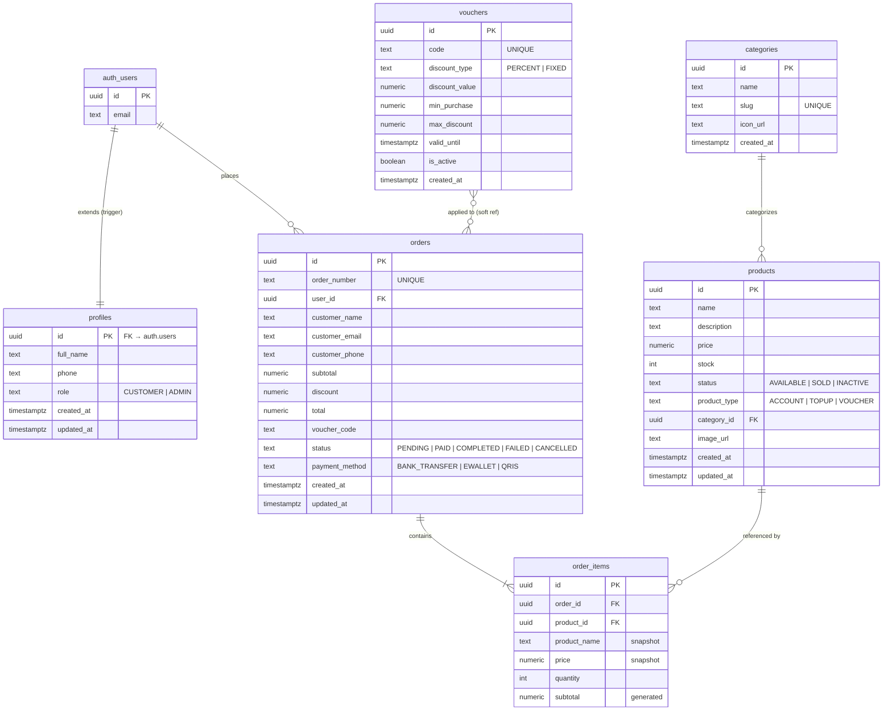

# Johen Gaming — Gaming Marketplace

Prototype marketplace untuk jual-beli akun & top-up game. Dibuat sebagai penilaian Fullstack Developer di PT Johen Gaming.

---

## Tech Stack & Alasan Pemilihan

| Layer | Teknologi | Alasan |
|-------|-----------|--------|
| Framework | **Next.js 16.2 (App Router)** | SSR + RSC memungkinkan data fetching di server — produk & kategori langsung tersedia saat HTML dikirim, lebih cepat dari SPA murni. File-based routing mempercepat scaffold. |
| Database & Auth | **Supabase (PostgreSQL)** | BaaS managed = tidak perlu setup server auth sendiri. RLS di level database menjamin data isolation per user. Supabase Storage menangani upload gambar produk secara konsisten. |
| State Management | **Zustand v5 + `persist`** | Ringan, tidak ada boilerplate reducer. Cart di-persist ke `localStorage` agar tidak hilang saat refresh — sesuai ekspektasi pengguna e-commerce. |
| Styling | **Tailwind CSS v4** | Utility-first mempercepat iterasi desain tanpa context switching ke file CSS terpisah. v4 menghapus `purge` config — build lebih cepat dengan Turbopack. |
| UI Components | **shadcn/ui** | Komponen headless yang fully owned (bukan dependency) — bisa dimodifikasi bebas untuk theming dark marketplace. |
| Validasi | **Zod v4 + React Hook Form** | Schema tunggal dipakai di client (real-time feedback) dan server (route handler) — tidak ada duplikasi validasi logic. |
| Notifikasi | **Sonner** | Toast ringan, animasinya tidak mengganggu dark theme, zero config. |
| QR Code | **qrcode.react** | Kebutuhan spesifik payment modal (QRIS/E-Wallet). Library kecil, SVG output skalabel. |

---

## Arsitektur

```
┌─────────────────────────────────────────────────────────┐
│                    Browser (React 19)                   │
│  Client Components ─── Zustand Store (cart persist)    │
└────────────────────────┬────────────────────────────────┘
                         │ fetch('/api/...')
┌────────────────────────▼────────────────────────────────┐
│              Next.js 16 App Router (Node.js)            │
│                                                         │
│  middleware.ts ──── auth guard (/admin/*, /checkout)   │
│                                                         │
│  Route Handlers (/api/*)                                │
│  ├── auth/login  register  logout                       │
│  ├── products  products/:id                             │
│  ├── categories                                         │
│  ├── orders  orders/:orderNumber                        │
│  ├── vouchers/validate                                  │
│  └── admin/stats                                        │
│                                                         │
│  Service Layer                                          │
│  ├── auth.service.ts  (signIn, signUp)                  │
│  ├── product.service.ts  (list, getById, CRUD)          │
│  ├── category.service.ts  (list, CRUD)                  │
│  ├── order.service.ts  (create via RPC, list, get)      │
│  └── voucher.service.ts  (validate)                     │
└────────────────────────┬────────────────────────────────┘
                         │ @supabase/ssr
┌────────────────────────▼────────────────────────────────┐
│                      Supabase                           │
│  PostgreSQL ── RLS policies ── Storage (images)         │
│  Auth (JWT, sessions via cookies)                       │
│  RPC: create_order_atomic (transactional order insert)  │
└─────────────────────────────────────────────────────────┘
```

### Alur Request (Checkout)

```
User isi form → validate (Zod + RHF)
  → PaymentModal terbuka (Bank Transfer / E-Wallet / QRIS)
  → User konfirmasi → POST /api/orders
      → order.service → supabase.rpc('create_order_atomic')
          → insert orders + order_items (atomic, 1 transaksi)
  → cart.clearCart() → redirect /order-success/:orderNumber
```

---

## Fitur

**Shop (Customer)**
- Browse produk dengan filter kategori & pencarian real-time
- Halaman detail produk
- Cart persisten (localStorage via Zustand)
- Checkout dengan validasi form lengkap
- Payment modal: Bank Transfer (Virtual Account), E-Wallet (QR), QRIS
- Halaman konfirmasi pesanan dengan ringkasan order
- Voucher diskon (PERCENT & FIXED)

**Admin Panel**
- Dashboard statistik (revenue, order, produk, user)
- Manajemen produk: tambah, edit, hapus, upload gambar
- Manajemen pesanan: filter status, lihat detail
- Route guard di middleware (ADMIN role only)

**Auth**
- Register & Login dengan Supabase Auth
- Session via HTTP-only cookies (`@supabase/ssr`)
- Role-based redirect: ADMIN → `/admin`, CUSTOMER → `/shop`

---

## Entity Relationship Diagram



> Semua tabel menggunakan **Row Level Security (RLS)**. `create_order_atomic` RPC mengeksekusi insert `orders` + `order_items` + decrement stock dalam satu transaksi atomik.

---

## Setup Lokal

### Prerequisites

- Node.js 20+
- pnpm (`npm i -g pnpm`)
- Akun [Supabase](https://supabase.com)

### Langkah

```bash
# 1. Clone & install
git clone <repo-url>
cd johen-marketplace
pnpm install

# 2. Environment variables
cp .env.local.example .env.local
# Isi nilai dari: Supabase Dashboard → Project Settings → API
```

**.env.local**

```env
NEXT_PUBLIC_SUPABASE_URL=https://<project-ref>.supabase.co
NEXT_PUBLIC_SUPABASE_ANON_KEY=<anon-key>
SUPABASE_SERVICE_ROLE_KEY=<service-role-key>
NEXT_PUBLIC_APP_URL=http://localhost:3000
```

```bash
# 3. Jalankan migrasi di Supabase SQL Editor (urutan penting):
#    supabase/migrations/20260525000001_init_schema.sql
#    supabase/migrations/20260525000002_rls_policies.sql
#    supabase/migrations/20260525000003_seed_data.sql
#    supabase/migrations/20260525000004_seed_images.sql
#    supabase/migrations/20260525000006_restore_image_text.sql

# 4. Jalankan dev server
pnpm dev
# Buka http://localhost:3000
```

---

## Demo Credentials

**URL**: https://johen-marketplace.vercel.app

| Role | Email | Password |
|------|-------|----------|
| Admin | admin@johengaming.com | admin123 |
| Customer | user@johengaming.com | user1234 |

> Buat akun customer baru via `/register`. Untuk akun admin baru: buat user di Supabase Dashboard → Authentication → Users, lalu set `role = 'ADMIN'` di tabel `profiles`.

---

## API Endpoints

### Auth

| Method | Path | Body | Keterangan |
|--------|------|------|------------|
| POST | `/api/auth/login` | `{ email, password }` | Login, set session cookie |
| POST | `/api/auth/register` | `{ email, password, full_name }` | Daftar akun baru |
| POST | `/api/auth/logout` | — | Hapus session |

### Produk & Kategori

| Method | Path | Query / Body | Keterangan |
|--------|------|--------------|------------|
| GET | `/api/products` | `page, limit, search, type, status, sort, category` | List produk (publik) |
| GET | `/api/products/:id` | — | Detail produk |
| POST | `/api/products` | FormData (fields + image) | Tambah produk (admin) |
| PUT | `/api/products/:id` | FormData | Update produk (admin) |
| DELETE | `/api/products/:id` | — | Hapus produk (admin) |
| GET | `/api/categories` | — | List kategori |

### Pesanan

| Method | Path | Body / Query | Keterangan |
|--------|------|--------------|------------|
| POST | `/api/orders` | `{ customer_name, customer_email, customer_phone?, payment_method, items[], voucher_code? }` | Buat pesanan (auth required) |
| GET | `/api/orders` | `page, limit, status` | List pesanan (admin) |
| GET | `/api/orders/:orderNumber` | — | Detail pesanan |

### Voucher

| Method | Path | Body | Keterangan |
|--------|------|------|------------|
| POST | `/api/vouchers/validate` | `{ code, subtotal }` | Validasi & hitung diskon |

### Admin

| Method | Path | Keterangan |
|--------|------|------------|
| GET | `/api/admin/stats` | Statistik dashboard (admin only) |

**Format response:**

```json
{ "success": true, "data": { ... } }
{ "success": false, "error": "Pesan error" }
```

---

## SDLC Notes

- **Gambar produk (dev)**: Menggunakan `placehold.co` (colored placeholder dengan label). Untuk production, upload gambar asli via Admin Panel → form produk → Supabase Storage.
- **Gambar kategori**: Diambil dari Wikimedia Commons (lisensi CC, CDN stabil). Ganti dengan aset resmi sebelum production.
- **Payment flow**: Simulasi — VA number, QR code, dan QRIS bersifat demo. Production membutuhkan integrasi payment gateway (Midtrans/Xendit webhook).
- **Order status**: Tetap `PENDING` setelah checkout simulasi. Webhook payment gateway akan mengupdate status ke `PAID`/`FAILED`.